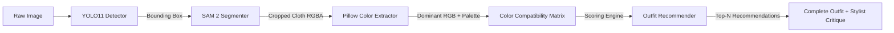

# AI Wardrobe Suggestor — Aesthetic & Taste Ranking Matrix

This document outlines the **Mathematical Ranking Matrix, Aesthetic Rules, and Multi-Dimensional Scoring Engine** built into the AI backend (`ai/color_matrix.py`, `ai/recommender.py`, and `ai/color_extractor.py`) to judge and score sartorial taste, color harmony, and outfit cohesion.

---

## 1. High-Level Scoring Formula

The overall outfit recommendation score ($S_{\text{total}}$) is calculated using a weighted multi-factor utility function:

$$\text{Match Percentage} = w_{\text{color}} \cdot S_{\text{color}} + w_{\text{occasion}} \cdot S_{\text{occasion}} + w_{\text{season}} \cdot S_{\text{season}} + w_{\text{silhouette}} \cdot S_{\text{silhouette}}$$

### Standard Weight Distribution

| Metric Component | Weight ($w_i$) | Purpose |
| :--- | :---: | :--- |
| **Color Harmony ($S_{\text{color}}$)** | **40% – 60%** | Evaluates palette synergy via the Color Compatibility Matrix and 60-30-10 color rule. |
| **Occasion Adherence ($S_{\text{occasion}}$)** | **25%** | Verifies dress code alignment across all garments (e.g., Formal, Smart Casual, Party, Sports). |
| **Seasonal Fit ($S_{\text{season}}$)** | **20%** | Assesses fabric weight, breathability, and temperature compatibility (Summer, Autumn, Winter, Spring). |
| **Silhouette & Style Balance ($S_{\text{silhouette}}$)** | **15%** | Evaluates proportion balance (e.g., fitted vs. relaxed cuts, footwear appropriateness). |

---

## 2. Color Compatibility Matrix (Pairwise Matrix)

The system contains an explicit pairwise compatibility matrix evaluated between all garment pairs in an ensemble ($C_i, C_j$). Scores range from **0 to 100**:

```
                       Navy   White   Black   Grey   Beige   Brown   Olive   Charcoal   Cream
       Navy Blue  [    --      99      84      96      98      95      86       90        98   ]
           White  [    99      --      99      96      97      94      96       98        88   ]
           Black  [    84      99      --      97      95      78      88       94        92   ]
            Grey  [    96      96      97      --      86      80      88       95        86   ]
           Beige  [    98      97      95      86      --      96      97       86        94   ]
           Brown  [    95      94      78      80      96      --      94       80        98   ]
           Olive  [    86      96      88      88      97      94      --       88        96   ]
        Charcoal  [    90      98      94      95      86      80      88       --        86   ]
           Cream  [    98      88      92      86      94      98      96       86        --   ]
```

### Pairwise Scoring Principles

1. **The Neutral Foundation Rule ($\ge 95$)**:
   - Universal neutrals (*Navy Blue, White, Black, Grey, Charcoal, Beige, Cream, Khaki*) anchor an ensemble.
   - High-contrast pairings score highest: `Navy + White = 99`, `Black + White = 99`, `Navy + Beige = 98`, `Cream + Brown = 98`.
2. **Earth-Tone Affinity ($\ge 94$)**:
   - `Olive + Beige = 97`, `Olive + Cream = 96`, `Brown + Beige = 96`, `Khaki + Navy = 96`.
   - Creates an organic, subdued luxury aesthetic (Quiet Luxury / Old Money).
3. **Monochromatic & Tonal Harmony ($92$)**:
   - Same-hue pairings (e.g., Charcoal Trousers + Light Grey Knit, or Navy Blazer + Sky Blue Oxford) receive a **92** baseline with texture contrast bonuses.
4. **Clash Penalties ($< 65$)**:
   - Direct saturation clashes without neutral grounding (e.g., Neon Green + Bright Orange, or Black + Dark Brown without separator tones) are penalized to prevent visually jarring combinations.

---

## 3. Outfit Palette Evaluation: The 60-30-10 Rule

When multiple garments are assembled into an outfit ($N$ pieces), the overall color score $S_{\text{color}}$ is calculated as:

$$S_{\text{color}} = \frac{2}{N(N-1)} \sum_{i=1}^{N-1} \sum_{j=i+1}^{N} \text{Compatibility}(C_i, C_j)$$

### Aesthetic Classification Categories

The engine classifies each recommended outfit into an aesthetic archetype based on the composition:

| Aesthetic Archetype | Criteria | Stylist Description |
| :--- | :--- | :--- |
| **Classic Neutral Harmony** | All garments belong to the neutral set. | *"Sophisticated balance of neutrals providing an effortless, timeless aesthetic."* |
| **Two-Tone Complementary** | Exactly two primary colors (e.g., 60% Navy, 30% White, 10% Gold/Silver). | *"High-contrast synergy following the classic 60-30-10 rule."* |
| **Earth Tone Synergy** | Palette features Olive, Beige, Brown, Cream, or Khaki. | *"Organic, warm earth-toned palette exuding relaxed quiet luxury."* |
| **Monochromatic Elegance** | Dominant single hue with tonal gradients. | *"Sleek, streamlined monochromatic silhouette."* |
| **Balanced Multi-Tone** | 3+ distinct colors supported by neutral footwear/bottoms. | *"Modern, curated color composition with balanced chromatic affinity."* |

---

## 4. Occasion Compatibility Matrix

Items are evaluated against the target occasion to ensure functional and social appropriateness:

| Target Occasion | Preferred Tops | Preferred Bottoms | Preferred Outerwear | Preferred Footwear | Preferred Accessories |
| :--- | :--- | :--- | :--- | :--- | :--- |
| **Business Formal** | Oxford Shirts, Formal Shirts | Pleated Trousers, Chinos | Blazers, Suits | Loafers, Brogues, Oxfords | Leather Watches, Ties, Belts |
| **Smart Casual** | Oxford Shirts, Polo Shirts, Clean T-Shirts | Chinos, Clean Denim | Blazers, Knit Sweaters, Jackets | Minimal Sneakers, Loafers | Metal Watches, Messenger Bags |
| **Casual** | T-Shirts, Hoodies, Casual Shirts | Jeans, Shorts, Track Pants | Denim Jackets, Bombers | Sneakers, Athletic Shoes, Flip Flops | Backpacks, Caps, Sunglasses |
| **Party / Evening** | Dark Shirts, Silk Tops, Tunics | Tailored Trousers, Dark Denim | Structured Blazers, Trench Coats | Chelsea Boots, Heels, Loafers | Dress Watches, Statement Jewellery |
| **Sports / Athleisure** | Athletic Tees, Tanks | Track Pants, Compression Shorts | Windbreakers, Hoodies | Running Shoes, Trainers | Sports Watches, Gym Bags |

### Occasion Score Penalty Matrix

- **Direct Match**: $S_{\text{occasion}} = 95 - 100$
- **Compatible Shift** (e.g., *Smart Casual* top with *Casual* bottom): $S_{\text{occasion}} = 85 - 90$
- **Incompatible Clash** (e.g., *Business Formal* Blazer with *Gym Track Shorts*): $S_{\text{occasion}} \le 40$

---

## 5. Vision-to-Ranking Ingestion Pipeline



1. **YOLO11**: Isolates garment region with coordinates $[x_1, y_1, x_2, y_2]$ and confidence score $\ge 0.88$.
2. **SAM 2**: Generates a pixel-accurate mask and crops the cloth with a transparent alpha channel.
3. **Pillow Analysis**: Filters background and calculates luminance, warmth ($R - B$), and palette percentages.
4. **Matrix Scoring**: Computes cross-garment affinity scores with the catalog items.
5. **Stylist Synthesis**: Produces structured advice explaining why the items look cohesive.

---

## 6. Score Interpretation Benchmark

| Match % Range | Quality Tier | Engine Action |
| :---: | :--- | :--- |
| **95% – 100%** | **Exceptional (Editorial Grade)** | Presented as primary recommendations with highlighted stylist accolades. |
| **90% – 94%** | **Strong (Highly Recommended)** | Standard daily outfit rotation. High color harmony and dress-code synergy. |
| **80% – 89%** | **Good (Acceptable Everyday)** | Workable casual combinations with minor color or occasion variance. |
| **< 80%** | **Suboptimal** | Filtered out by the engine; rejected from recommendation feed. |

---

## 7. Relevant Implementation Source Code

- **Color Compatibility Matrix**: [`ai/color_matrix.py`](file:///c:/Users/L94/Desktop/Wardrobe%20Suggestor/ai/color_matrix.py)
- **Multi-Factor Recommendation Engine**: [`ai/recommender.py`](file:///c:/Users/L94/Desktop/Wardrobe%20Suggestor/ai/recommender.py)
- **Pillow Color & Palette Extractor**: [`ai/color_extractor.py`](file:///c:/Users/L94/Desktop/Wardrobe%20Suggestor/ai/color_extractor.py)
- **FastAPI Endpoint for Color Harmony**: [`ai/api.py`](file:///c:/Users/L94/Desktop/Wardrobe%20Suggestor/ai/api.py)
